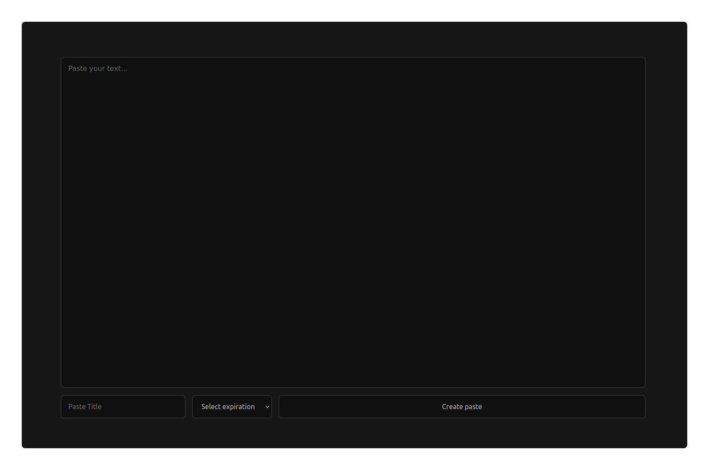

<a name="readme-top"></a>

<br />
<div align="center">
  <a href="https://github.com/fabiansefranek/paste">
    
  </a>

  <h3 align="center">Paste</h3>

  <p align="center">
    Serverless Pastebin Alternative built with Cloudflare Workers 
    <br>
    <a href="https://paste.sefranek.io">View Demo</a>
    ·
    <a href="https://github.com/fabiansefranek/paste/issues">Report Bug</a>
    ·
    <a href="https://github.com/fabiansefranek/paste/issues">Request Feature</a>
  </p>
</div>


<!-- TABLE OF CONTENTS -->
<details>
  <summary>Table of Contents</summary>
  <ol>
    <li>
      <a href="#about-the-project">About The Project</a>
      <ul>
        <li><a href="#built-with">Built With</a></li>
      </ul>
    </li>
    <li>
      <a href="#getting-started">Getting Started</a>
      <ul>
        <li><a href="#prerequisites">Prerequisites</a></li>
        <li><a href="#installation">Installation</a></li>
      </ul>
    </li>
    <li><a href="#usage">Usage</a></li>
    <li><a href="#roadmap">Roadmap</a></li>
  </ol>
</details>


<!-- ABOUT THE PROJECT -->
## About The Project


This service can be used as an self-hosted alternative to Pastebin. 
Features: Paste Expirations & No Client-Side Javascript

<p align="right">(<a href="#readme-top">back to top</a>)</p>


### Built With

This paste service is built on top of the Cloudflare Serverless Platform, specifically with Cloudflare Workers and Cloudflare Workers KV.

<p align="right">(<a href="#readme-top">back to top</a>)</p>


<!-- GETTING STARTED -->
## Getting Started

To get this service up and running follow these simple steps.

### Prerequisites

This is an example of how to list things you need to use the software and how to install them.
  ```sh
  npm install wrangler
  ```

### Installation

1. Login to Wrangler with ```wrangler login```
2. Clone the repo
   ```sh
   git clone https://github.com/fabiansefranek/paste.git
   ```
3. Update dependencies
   ```sh
   npm install
   ```
4. Create Cloudflare Workers KV Namespace
   ```sh
   wrangler kv:namespace create "paste"
   ```
5. Copy KV Namespace ID to wrangler.toml Bindings
   
6. Publish
   ```sh
   wrangler publish
   ```

<p align="right">(<a href="#readme-top">back to top</a>)</p>


<!-- ROADMAP -->
## Roadmap

- [ ] Burn after Read
- [ ] Syntax Highlighting

<p align="right">(<a href="#readme-top">back to top</a>)</p>
